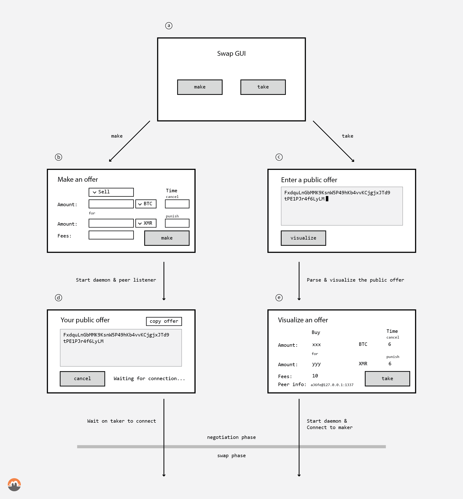
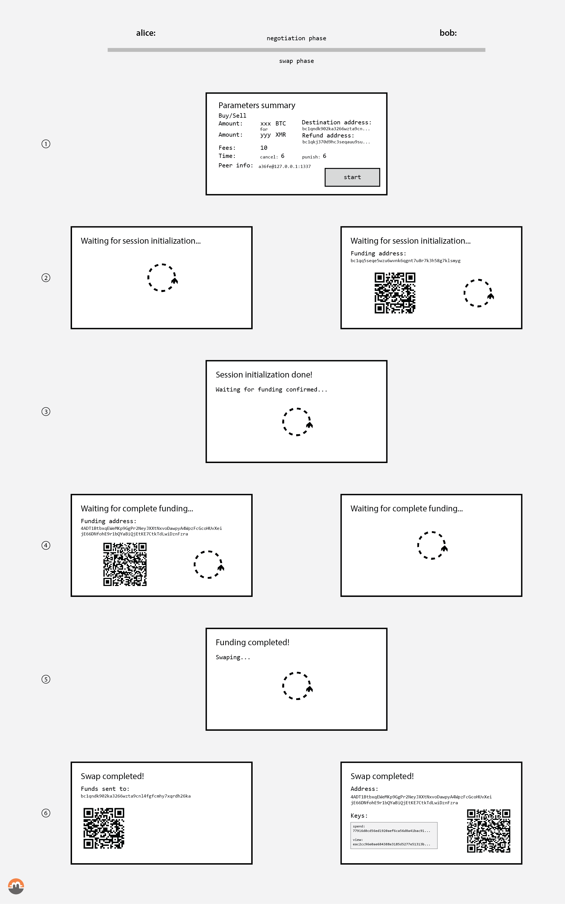

<pre>
  State: draft
  Created: 2020-11-11
</pre>

# 02. User Stories

## Overview

This RFC describes the roles and phases of a swap and presents the user stories of each participant by the mean of mockups and examples. We distinguish between two phases: negotiation and swap phases, this RFC describe the interface between the phases. Those phases imply roles, and those roles allow user actions. This RFC describe the user actions available for each role during the phases.

## Table of Contents

  * [Negotiation phase](#negotiation-phase)
    * [Propose a swap](#propose-a-swap)
    * [Create an offer](#create-an-offer)
    * [Create a public offer](#create-a-public-offer)
    * [Take a public offer](#take-a-public-offer)
    * [Results of negotiation phase](#results-of-negotiation-phase)
    * [GUI Example](#gui-example)
    * [CLI Example](#cli-example)
  * [Swap phase](#swap-phase)
    * [Steps](#steps)

## Negotiation phase

### Propose a swap

As a participant who wants to propose a swap to other participants, I will choose the maker role and start my node so that I can create a public offer, see [10. Public Offer](./10-public-offer.md), share it, and later a taker will be able to connect to my node and execute the swap with me.

The maker starts her node in maker mode and registers all the parameters an offer requires, see below for more details. The daemon start listening on a port or creates an onion service, depending on its configuration, and waits for an incoming connection. When ready, the daemon prints the *public offer*. The public offer contains all the parameters a taker needs to connect. The maker can then distribute the public offer over her preferred channels.

### Create an offer

To create an offer, a maker registers the following list of required inputs:

 * The Arbitrating/Accordant blockchain identifier, e.g. BTC-XMR; *Must identify: blockchain chain and asset traded. E.g. bitcoin on mainnet or bitcoin on testnet. This can be done through a `chain_hash` parameter or be defined by an RFC in Farcaster.*
 * The arbitrating blockchain asset amount; *In the unit type defined by the blockchain.*
 * The accordant blockchain asset amount; *In the unit type defined by the blockchain.*
 * The timelock durations used during the swap, they define the two time frames for cancelling the swap on-chain and punishing Bob if he doesn't react after a swap cancellation; *In the unit type defined by the blockchain.*
 * The fee calculation strategy, defines the transactions fee strategy to use on e.g. BTC transactions; *This might be fixe, within a range, or defined as a function or a more evolved type.*
 * The future maker swap role (Alice or Bob); *Taker role is derived from this as the protocol always have one Alice and one Bob.*

The client user interface should provide an easy way to define an offer through e.g. a Buy or Sell point of view, and may auto-fill the fee strategy based on user prefered fee estimators.

For the participant who plays Bob's role during the swap the fee strategy and the timelock durations are critical values to guarentee safety and potential funds recovery. Too short timelock duration or too low fee strategy might allow Alice to punish Bob even if he behaves accordingly to the protocol. The swap client should carefully check these parameters as a regular wallet whould do for the fees.

### Create a public offer

A maker public offer is an extended maker offer with the daemon's network parameters, such as options detailing how to connect to the daemon. The public offer must specify the node's connection identifier and must contain a valid signature to reduce on-transit offer's modification.

The maker public offer must be as user-friendly as possible, as it is the responsibility of the user to share this public offer with a potential counter-party via the maker's preferred communication channels. Thus the format might still be binary, but parsers should be created to ease integration on diverse platforms.

The maker does not validate nor filter who can connect and take the public offer, at least not at the protocol level yet. Daemon can be extended by adding a whitelist of daemon that can connects in the future or "private" networks can be used to share the public offer, thus this does not prevent the offer to be reshared on other networks.

### Take a public offer

As a participant who wants to find a swap, I will browse forums, chats, IRCs and all other places where I can find public offers from makers so that I can choose one fitting my needs and try to connect and execute the swap.

A taker sees a public offer, parses and visualizes it, and might accept it. If the taker wants to take the public offer he can try to connect to the maker and start the swap. This RFC does not define where the public offers are listed nor how a participant might have access to them.

As this protocol does not ensure that the public offer is still live nor already taken, this action can fail. The maker might have "cancel" the offer by shuting down her node, or other taker might have connected already to the node.

### Results of negotiation phase

We define in this RFC the interface between the negotiation and swap phase. At the beginning of the swap phase, participants must end up in a state where:

 * Daemons are connected to each other
 * They validated a set of parameters containing:
     * Blockchains & assets used as an Arbitrating-Accordant asset pair, e.g. BTC-XMR
     * Amount exchanged of each asset, e.g. 200 XMR and 1.3 BTC
     * Transition from Maker-Taker roles into Alice-Bob roles
     * Timelock durations for canceling the swap and punishing Bob's non-reaction
     * Fee strategy applied to arbitrating transactions

### GUI Example

We present a simple user interface for starting with the role of a maker or a taker and the steps that must follow each choice.

#### Maker

As a maker, I start my client and choose the maker role (**A. Choose a negotiation role**). When started in maker mode, my client will ask me a list of required inputs (**B. Create an offer**). When completed my client starts my daemon in listening mode. When the daemon is ready, the client displays the public offer (**D. Start and display the public offer**) and waits for an incoming connection. It is now my responsability to share and forward this public offer to potential swappers.

#### Taker

As a taker, I start my client and choose the taker role (**A. Choose a negotiation role**). When started in taker mode, my client prompts me a public offer (**C. Paste a public offer**). The pasted public offer is parsed and displayed to the user for verification and acceptance (**E. Visualize a public offer**). If I want to take it, my daemon is started and connects to the daemon specified in the public offer. If the maker daemon is still up and no one already took the offer, the swap may succeed.


*Fig 1. Example of a GUI executing the 'discover, connect, and accept' mechanism*

### CLI Example

This section presents an example of a CLI swap client. This is provided for educational purposes, the swap CLI client may look different.

**Maker** starting his node:
```
$ swap-cli --make
> Pair: BTC-XMR
> BTC: 0.3
> XMR: 10
> Cancel Timelock: 4
> Punish Timelock: 10
> Fee strategy ([F]ixe, [R]ange, [D]ynamique): R
> Fee range (sat/vB): 10-40
> Role ([A]lice,[B]ob): A

You chose Alice:
> Bitcoin destination address: bc1qndk902ka3266wzta9cnl4fgfcmhy7xqrdh26ka

Exchange 0.3 BTC for 10 XMR? [y/N] y

Starting daemon in Maker mode...

Your public offer:
FxdquLnGbMMK9KsnW5P49hKb4vvKCjgjxJTd9tPE1PJr4f6LyLM

Waiting for incoming connection...
```

**Taker** visualizing a public offer and accepting the deal:
```
$ swap-cli --take --offer FxdquLnGbMMK9KsnW5P49hKb4vvKCjgjxJTd9tPE1PJr4f6LyLM
Public offer
: Pair: BTC-XMR
: BTC: 0.3
: XMR: 10
: Cancel Timelock: 4
: Punish Timelock: 10
: Fee range (sat/vB): 10-40
: Your role: Bob
: Counterparty role: Alice

Exchange 10 XMR for 0.3 BTC? [y/N] y

You are Bob:
> Bitcoin refund address: bc1qkj370d9hc3seqauu9sujm96aqfw5ml9a46ejfa

Connecting to counterparty daemon...
```

## Swap phase

The swap phase starts for each role with the common set of parameters defined above as the interface, the public offer.

plus for Alice's role:

 * The destination Arbitrating address

and for Bob's role:

 * The refund Arbitrating address

Those addresses are inputs asked by the client before the beginning of the swap and should follow the address *reuse* stategy for the concerned blockchain.

During the swap phase the client may propose to the user an *abort* action. It is to the client implementation to define how a user can abort a conducting swap or not. We recommend that the client allows the user to *abort* only before detecting money locked on-chain.

### Steps

We describe the high-level view of the swap phase with four steps:

 1. Initialization step
 2. Arbitrating locking step
 3. Accordant locking step
 4. Swap step

We describe a basic user experience with an atomic swap GUI client for Alice and Bob. This is provided for educational purposes and to give an idea to the reader, the swap GUI client may look different depending on the platform (mobile, desktop, cli, etc) and potential wallet integration.

The design proposed here does not make any asumption about wallet integration. All the funds can arise from external wallet with no restriction on the form factor. However, this as the cost of an extra transaction on the Arbitrating blockchain, but can be removed if the client is closely integrated in a wallet.


*Fig 2. Example of a GUI executing a swap*

#### 1. Initialization Step (1 in the diagram)
Alice and Bob start the pre-initialization. They exchange and verify parameters specified in [04. Protocol Messages](./04-protocol-messages.md) RFC. If the validation successfully terminates, the client moves to the next step.

##### Messages exchanged:

*First round, commit to values*

> Messages can arrive in any order

- Alice → Bob: [`commit_alice_session_params`](./04-protocol-messages.md#the-commit_alice_session_params-message)
- Bob → Alice: [`commit_bob_session_params`](./04-protocol-messages.md#the-commit_bob_session_params-message)

*Second round, reveal values*

> Messages can arrive in any order

- Alice → Bob: [`reveal_alice_session_params`](./04-protocol-messages.md#the-reveal_alice_session_params-message)
- Bob → Alice: [`reveal_bob_session_params`](./04-protocol-messages.md#the-reveal_bob_session_params-message)

#### 2. Arbitrating Locking Step (2-3 in the diagram)
After the parameters are exchanged and validated, Bob asks the user for funding. Upon receiving funds, Bob creates the transactions, signs the cancel path, and sends them to Alice with `core_arbitrating_setup` protocol message. He acquires Alice's signatures for the cancel path. The bitcoin are locked when Bob is able to trigger the cancel path and refund the assets, i.e. after reception of `refund_procedure_signatures` protocol message.

##### Messages exchanged:

- Bob → Alice: [`core_arbitrating_setup`](./04-protocol-messages.md#the-core_arbitrating_setup-message)
- Alice → Bob: [`refund_procedure_signatures`](./04-protocol-messages.md#the-refund_procedure_signatures-message)

#### 3. Accordant Locking Step (4 in the diagram)
Once Alice has received sufficient confirmations for Bob's `lock (b)` transaction to feel safe, Alice proceeds to lock her monero with the Monero `lock (x)` transaction.

#### 4. Swap Step (5-6 in the diagram)
Once Bob has received sufficient confirmations for the Monero `lock (x)` transaction to feel safe, Bob sends Alice the `buy (c)` encrypted signature, which Alice requires to execute the first branch of the `lock (b)` transaction output script via the `buy (c)` transaction.

Alice then signs the `buy (c)` transaction to complete it and publishes it, leaking her Monero key share and finalizing her swap at the same time. Bob sees the `buy (c)` transaction in the mempool, extracts the Monero key share, and displays it to the user.

##### Message exchanged:

- Bob → Alice: [`buy_procedure_signature`](./04-protocol-messages.md#the-buy_procedure_signature-message)

