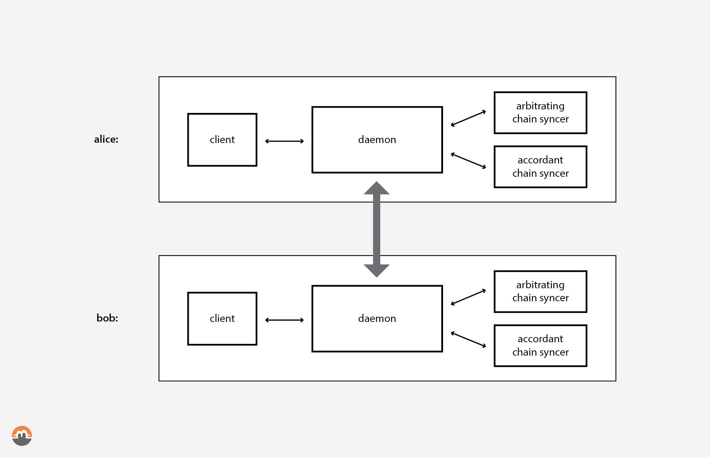
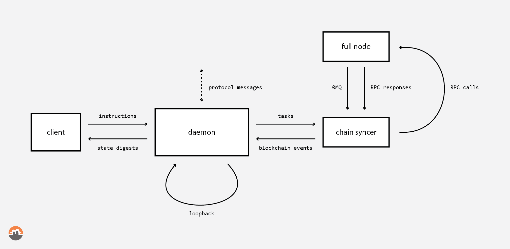

<pre>
  State: draft
  Created: 2020-11-11
</pre>

# 03. Farcaster Architecture

## Overview

This RFC describes the overall architecture and how the software stack of Farcaster is organized. It includes the swap state organization, its recovery process and a high-level overview of the three main components: client, daemon, and syncers.

## Table of Contents

  * [Global Architecture](#global-architecture)
    * [Client & Daemon segregation rationale](#client--daemon-segregation-rationale)
    * [Components interaction](#components-interaction)
  * [Daemon](#daemon)
    * [Counter-party daemon communication](#counter-party-daemon-communication)
    * [Blockchain communication](#blockchain-communication)
    * [Client-Daemon communication](#client-daemon-communication)
    * [Loopback: self-generated input messages](#loopback-self-generated-input-messages)
  * [Syncer](#syncer)
  * [Client](#client)

## Global Architecture

We segregated three main conceptual components: `client`, `daemon`, and `syncers`.

- The `client` drives the swap,
- The `daemon` orchestrates the swap protocol execution and
- The `syncer` maintains the protocol state and the blockchain state in sync

The figure below represents the general architecture based on these three main types of components.

*Fig 1. Farcaster High-Level Components Architecture*

The following table summarizes different aspects of each component.

|                              | `client`                                                          | `daemon`                                                     | `syncer`                                        |
|------------------------------|-------------------------------------------------------------------|--------------------------------------------------------------|-------------------------------------------------|
| Definition                   | a program that controls the daemon and displays the current state | a program that executes the core protocol in a state machine | a program that talks with a specific blockchain |
| Cryptographic keys & secrets | private & public                                                  | public only`*`                                               | public only`*`                                  |
| Client/User                  | end-user                                                          | `client`, counter-party `daemon`                             | `daemon`                                        |
| Availability                 | present at the start and to sign                                  | mostly online, channel of communication between parties      | always online                                   |
| Communicates with            | `daemon`                                                          | `client`, `syncer`, counter-party `daemon`                   | `daemon`, blockchain                            |
| Transactions                 | creates all transactions, signs                                   | verifies transactions and signatures                         | listens for and publishes transactions          |
| Protocol state               | doesn't understand protocol, but can represent its state          | understands the protocol, but can't sign                     | doesn't understand protocol                     |

 `*` the exception is any keys needed to read the blockchain state and detect transactions or amounts, e.g. a private view key for the Monero accordant blockchain.

### Client & Daemon segregation rationale

The rationale behind segregating the client and the daemon currently is not for security reasons - the client signs the transactions received from the daemon blindly, implying full trust (see *Security considerations* in [06. Datum & Instructions](./06-datum-and-instructions.md#security-considerations) RFC).

The client is the only component that has access to secret keys.

The aim of this segregation is to improve flexibility and extensibility added by making the client peripheral to the swap stack, that is, other clients might be created, such as:

- clients supporting hardware wallets
- mobile applications (that may run the daemon in the background or in a private server),
- heavy- or light-weight desktop GUIs,
- scripted/automated backend clients (e.g. run by market makers, OTCs etc)

### Components interaction

Each swap component is represented as a black box that consumes input messages and produces output messages. Each input and output message is a typed message. Components subscribe to types of messages, e.g. the client may not consume messages produced by syncers but will subscribe to daemon's messages.

*Fig 2. Typed messages exchanged between components*

It is worth noting that this diagram (Fig. 2) only shows one syncer, but a syncer per blockchain is required. Conceptually even more than one syncer per blockchain makes sense if you don't run or trust the syncer you are using, in that case, one can aggregate and compare different data sources and detect discrepancies.

## Daemon

The Daemon is the central component responsible for orchestrating the protocol execution.

Its main function is to manage the safe progression of the execution of the cross-chain atomic swap in response to the intrinsic and extrinsic messages it receives - respectively coming from itself and from the components it directly interacts with.

The Daemon MUST be fully aware of the complete state of the cross-chain atomic swap execution. To achieve that it must listen to:

- counter-party daemon protocol messages via inter-daemon communication (see [04. Protocol Messages](./04-protocol-messages.md)),
- blockchain events from both chains via syncers (see [05. Tasks & Blockchain Events](./05-tasks-and-events.md)),
- user's instructions via Client communication (see [06. Datum & Instructions](./06-datum-and-instructions.md)), and
- self-produced loopback messages

The Daemon must create a constrained runtime environment for executing the protocol, that only permits valid protocol transitions at all times. To achieve that a Petri net model of the protocol may be used to constrain the runtime environment that executes the user's respective swap role in the protocol, by only authorizing firing valid enabled protocol transitions.

### Counter-party daemon communication

The Daemon has a bidirectional communication channel with the swap counter-party's daemon. This inter-daemon communication is used to pass protocol messages between the swap counterparties (see [04. Protocol Messages](./04-protocol-messages.md)).

### Blockchain communication

A Daemon does not interact with a blockchain fullnode or a public API directly. Actions and queries are done via a syncer through `tasks` and `blockchain events` (see [05. Tasks & Blockchain Events](./05-tasks-and-events.md)).

A syncer handles `tasks` requests from a daemon and produces `blockchain events` according to blockchain state changes.

### Client-Daemon communication

Client and daemon communicate via `datum` and `instruction` messages (see [06. Datum & Instructions](./06-datum-and-instructions.md)). The architecture must allow a client and a daemon to run on different machines.

### Loopback: self-generated input messages

The daemon may generate self-addressed messages. Those messages may be used to trigger transitions only based on the daemon's state, such as timers. Those transitions can e.g. represent the absence of counter-party daemon communication during a period of time, which may trigger the swap cancellation.

## Syncer

A syncer is specific to a blockchain and can handle a list of `tasks` related to it. Those `tasks` will be completed in different manners depending on the blockchain type and/or the blockchain state. Syncers allow the daemon to abstract a part of the logic needed to interact with a blockchain with a defined interface composed of `tasks` and `blockchain events` (see [05. Tasks & Blockchain Events](./05-tasks-and-events.md)).

## Client

The client is the only component aware of the user's private keys and acts as a "swap wallet", creating and signing the blockchain transactions and communicating with the daemon through `datum` and `instruction` messages.

`datum` and `instruction` messages are asynchronous and may fail, the daemon must handle missing messages from a client, and vice versa, and may modify the swap state in response.

Client and daemon must have an initialization protocol allowing one or the other to recover from a past swap state.

Client passes `datum` and `instruction` messages to the daemon. That is, client may at the user's discretion fire one of the possible protocol transitions at each moment in time. A subset of transitions may require transactions, signatures, or keys as input which are transmitted via `datum` messages. Upon client's message reception, daemon must undertake the actions associated with the fired transition, and update the swap state accordingly. Daemon updates client with the same type of messages: `datum` and `instruction`, to move forward with the swap protocol execution.
