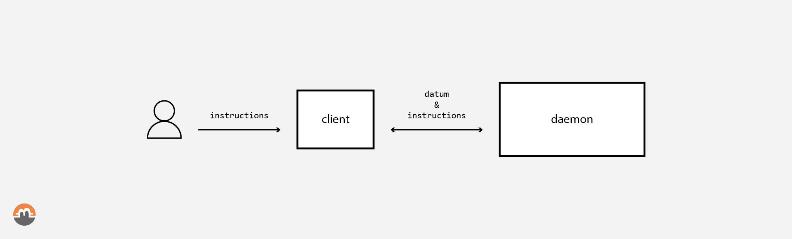

<pre>
  State: draft
  Created: 2021-02-03
</pre>

# 06. Datum & Instructions

## Overview

This RFC specifies the messages exchanged between the user's swap client and its daemon.
As sketched below, the `client`→`daemon` and `daemon`→`client` routes consist of `datum` and `instruction` messages. They control the state transitions of an ongoing swap. The `client` must present control choices to the end-user during the progression of the protocol execution.

*Fig 1. Interactions between a client and a daemon.*

`datum` and `instructions` messages must follow the *'Type-Length-Value Format (TLV format)'* defines in *'BOLT #1: Base Protocol'* [[1](#references)] standard from the Lightning Network specifications.

## Table of Contents
  * [Security considerations](#security-considerations)
  * [Messages](#messages)
  * [Datum Messages](#datum-messages)
    * [The `transaction` Datum](#the-transaction-datum)
    * [The `key` Datum](#the-key-datum)
    * [The `signature` Datum](#the-signature-datum)
    * [The `proof` Datum](#the-proof-datum)
    * [The `parameter` Datum](#the-parameter-datum)
  * [Datum Bundles](#datum-bundles)
    * [The `alice_session_params` Bundle](#the-alice_session_params-bundle)
    * [The `bob_session_params` Bundle](#the-bob_session_params-bundle)
    * [The `cosigned_arbitrating_cancel` Bundle](#the-cosigned_arbitrating_cancel-bundle)
    * [The `core_arbitrating_transactions` Bundle](#the-core_arbitrating_transactions-bundle)
    * [The `signed_adaptor_buy` Bundle](#the-signed_adaptor_buy-bundle)
    * [The `fully_signed_buy` Bundle](#the-fully_signed_buy-bundle)
    * [The `signed_adaptor_refund` Bundle](#the-signed_adaptor_refund-bundle)
    * [The `fully_signed_refund` Bundle](#the-fully_signed_refund-bundle)
    * [The `signed_arbitrating_lock` Bundle](#the-signed_arbitrating_lock-bundle)
    * [The `signed_arbitrating_punish` Bundle](#the-signed_arbitrating_punish-bundle)
  * [Instructions: High level, Control flow messages](#instructions-high-level-control-flow-messages)
    * [The `abort` Instruction](#the-abort-instruction)
    * [The `next` Instruction](#the-next-instruction)
  * [References](#references)

## Security considerations

From a security perspective, an important distinction between the client and the daemon is that the daemon only knows public keys - private keys are the privy treasure of the client`(*)`. Nonetheless, the daemon MUST be viewed as a trusted component, since it exclusively verifies the correctness of the counterparty's data, controls the swap state, and can misreport the progress of the swap to the client or mislead the client into invalid protocol states.

For instance, assuming the client is the arbitrating seller who initially owns BTC in a swap, and the cancel path is invoked: If the client signs the `refund (e)` transaction and instructs the daemon to relay it, a malicious daemon could abstain from relaying it, resulting in a loss of funds for the arbitrating seller, if he does not detect this error and submit the signed transaction via an alternate route before the accordant seller can submit the `punish (f)` transaction to punish the arbitrating seller `(**)`.

`*` *With the exception of all private keys needed to read the blockchain state, e.g. the private view key when the accordant blockchain is Monero.*

`**` *For a better understanding of the transaction structure see [08. Transactions](./08-transactions.md).*

## Messages

We define two categories of content composing the `datum` messages:

1. Results of cryptographic operation
   - Signatures (partial and finalized)
   - Keys (public keys and exceptional private 'view' keys)
   - Off-chain multi-signature protocol messages (e.g., musig2)
   - Zero knowledge proofs requires by the above protocols (e.g., cross-group discreet log equality)
2. Transactions; following *PSBT standard* & *BIP 174* [[2,3]](#references)

and a third category called `instruction` messages that represents:

3. Control flow operations
   - Accepting a step in the swap process
   - User or protocol canceling the swap

We illustrate the effect the client's messages exert over a daemon and its feedback loop back to the client. Both client and daemon have the responsibility to exchange valid `datum` and `instruction` messages based on their respective state and user actions. Please see the trust assumptions at [security considerations](#security-considerations).

A protocol transition moves the protocol execution forward, that is a step in the swap process. The set of states that fulfills the predicates for enabling a given transition must be selected, to be able to carry out the step in the swap process.

Please find below a high-level summary of this interaction:

 1. Valid `datum` and `instruction` messages sent by the client and/or the daemon control their respective states.
 2. Daemon consumes client `datum` and `instruction` messages and
 3. Daemon fires transitions that are in one-to-one correspondence with client message (if predicate conditions met)
 4. As a consequence of firing protocol transitions, the daemon's internal swap state may be modified
 5. If the swap state was modified, the daemon must send client messages providing the client with the data, i.e. `datum` messages, for the next user executions. When applicable, Daemon must as well spawn Syncer tasks.
 6. Client then may give new `datum` and/or `instruction` messages and progress on the protocol execution (back to step 1)

## Datum Messages

`datum` messages must convey all required data a daemon or a client needs to fulfill its mission, such as the keys or the transactions' signatures.

### The `transaction` Datum

The `transaction` datum is used to convey a transaction between clients and daemons. The transaction is transmitted within the `tx_value` field in its serialized format.

 1. type: ? (`transaction`)
 2. data:
    - [`u16`: `tx_id`] The identifier of the transaction
    - [`u16`: `tx_value_len`]
    - [`tx_value_len * byte`: `tx_value`] The serialized value of the transaction

The type of the transaction is derived from the `tx_id`:

 1. `tx_id`:
    - `0x01`: `funding (a)` arbitrating transaction
    - `0x02`: `lock (b)` arbitrating transaction
    - `0x03`: `buy (c)` arbitrating transaction
    - `0x04`: `cancel (d)` arbitrating transaction
    - `0x05`: `refund (e)` arbitrating transaction
    - `0x06`: `punish (f)` arbitrating transaction

### The `key` Datum

The `key` datum is used to convey keys between clients and daemons. The key is transmitted within the `key_value` field in its serialized format and is identified by the `key_id`.

 1. type: ? (`key`)
 2. data:
    - [`u16`: `key_id`] The identifier of the key
    - [`u16`: `key_value_len`]
    - [`key_value_len * byte`: `key_value`] The serialized value of the key

The type of the key is derived from the `key_id`:

 1. `key_id`:
    - `0x01`: `Ab` the accordant seller buy key
    - `0x02`: `Ac` the accordant seller cancel key
    - `0x03`: `Ar` the accordant seller refund key
    - `0x04`: `Ap` the accordant seller punish key
    - `0x05`: `Ta` the accordant seller adaptor key
    - `0x06`: `K_s^a` the accordant seller spend key
    - `0x07`: `K_v^a` the accordant seller private view key
    - `0x08`: `Bf` the arbitrating seller fund key
    - `0x09`: `Bb` the arbitrating seller buy key
    - `0x0a`: `Bc` the arbitrating seller cancel key
    - `0x0b`: `Br` the arbitrating seller refund key
    - `0x0c`: `Tb` the arbitrating seller adaptor key
    - `0x0d`: `K_s^b` the arbitrating seller spend key
    - `0x0e`: `K_v^b` the arbitrating seller private view key

### The `signature` Datum

The `signature` datum is used to convey signatures between clients and daemons. When this datum comes from a client, it is usually a signature freshly generated or adapted by the client. When the datum is emitted by the daemon to the client, it is usually an adaptor signature to be adapted by the client.

 1. type: ? (`signature`)
 2. data:
    - [`u16`: `tx_id`] The identifier of the related transaction, see `tx_id` definition
    - [`u16`: `role`] The swap role that emitted the signature
    - [`u16`: `sig_value_len`]
    - [`sig_value_len * byte`: `sig_value`] The serialized value of the signature, the signature can be a adaptor, adapted, or regular signature

The swap role:

 1. `role`:
    - `0x01`: the accordant seller
    - `0x02`: the arbitrating seller

### The `proof` Datum

The `proof` datum is used by clients to provides cryptographic proofs needed to secure the protocol.

 1. type: ? (`proof`)
 2. data:
    - [`u16`: `proof_id`] The identifier of the proof
    - [`u16`: `proof_value_len`]
    - [`proof_value_len * byte`: `proof_value`] The serialized value of the proof

The proof type is derived from the `proof_id`:

 1. `proof_id`:
    - `0x01`: Cross-group discrete logarithm proof

### The `parameter` Datum

The `parameter` datum is used to convey parameters between clients and daemons such as addresses, timelocks, fee strategies, etc. They are mostly used by clients to instruct daemons about user parameters and offer parameters.

 1. type: ? (`parameter`)
 2. data:
    - [`u16`: `param_id`] The identifier of the parameter
    - [`u16`: `param_value_len`]
    - [`param_value_len * byte`: `param_value`] The serialized value of the parameter

The type of the parameter is derived from the `param_id`:

 1. `param_id`:
    - `0x01`: the accordant seller destination address
    - `0x02`: the arbitrating seller refund address
    - `0x03`: Cancel timelock
    - `0x04`: Punish timelock
    - `0x05`: Fee strategy

## Datum Bundles

Datum described above is succinct and used to convey an atomic chunk of data (datum) between clients and daemons. We also present here the bundles used during the different steps of a swap by both the accordant seller and the arbitrating seller. A bundle is an aggregate of 1 or more `datum` generally related to each other.

### The `alice_session_params` Bundle

**Sent by**: the accordant seller clients|the arbitrating seller daemon

Provides the (counter-party) daemon with all the information required for the initialization step of a swap.

 1. data:
    - The buy `Ab` public key
    - The cancel `Ac` public key
    - The refund `Ar` public key
    - The punish `Ap` public key
    - The `Ta` adaptor public key
    - The destination Bitcoin address
    - The `K_v^a` view private key
    - The `K_s^a` spend public key
    - The cross-group discrete logarithm zero-knowledge proof
    - The `cancel` and `punish` timelocks
    - The fee strategy

### The `bob_session_params` Bundle

**Sent by**: the arbitrating seller clients|the accordant seller daemon

Provides the (counter-party) daemon with all the information required for the initialization step of a swap.

 1. data:
    - The buy `Bb` public key
    - The cancel `Bc` public key
    - The refund `Br` public key
    - The `Tb` adaptor public key
    - The refund Bitcoin address
    - The `K_v^b` view private key
    - The `K_s^b` spend public key
    - The cross-group discrete logarithm zero-knowledge proof
    - The `cancel` and `punish` timelocks
    - The fee strategy

### The `cosigned_arbitrating_cancel` Bundle

**Sent by**: the accordant seller|the arbitrating seller clients

Provides daemon with a signature on the unsigned `cancel (d)` transaction.

 1. data:
    - The `Ac|Bc` `cancel (d)` signature

### The `core_arbitrating_transactions` Bundle

**Sent by**: the arbitrating seller clients|the accordant seller daemon

Provides the arbitrating seller's daemon or the accordant seller's clients the core set of arbitrating transactions.

 1. data:
    - The `lock (b)` transaction
    - The `cancel (d)` transaction
    - The `refund (e)` transaction

### The `signed_adaptor_buy` Bundle

**Sent by**: the arbitrating seller clients|the accordant seller daemon

Provides the arbitrating seller's daemon or the accordant seller's client with an adaptor signature for the unsigned `buy (c)` transaction.

 1. data:
    - The `Bb(Ta)` `buy (c)` adaptor signature

### The `fully_signed_buy` Bundle

**Sent by**: the accordant seller clients|the arbitrating seller daemon

Provides the accordant seller's daemon or the arbitrating seller's clients with the two signatures on the unsigned `buy (c)` transaction.

 1. data:
    - The `Ab` `buy (c)` signature
    - The adapted `Bb(Ta)` `buy (c)` adaptor signature

### The `signed_adaptor_refund` Bundle

**Sent by**: the accordant seller clients|the arbitrating seller daemon

Provides the accordant seller's daemon or the arbitrating seller's clients with a signature on the unsigned `refund (e)` transaction.

 1. data:
    - The `Ar(Tb)` `refund (e)` adaptor signature

### The `fully_signed_refund` Bundle

**Sent by**: the arbitrating seller clients|the accordant seller daemon

Provides the arbitrating seller's daemon or the accordant seller's clients with the two signatures on the unsigned `refund (e)` transaction.

 1. data:
    - The `Br` `refund (e)` signature
    - The adapted `Ar(Tb)` `refund (e)` adaptor signature

### The `signed_arbitrating_lock` Bundle

**Sent by**: the arbitrating seller clients

Provides the arbitrating seller's daemon with the signature on the unsigned `lock (b)` transaction.

 1. data:
    - The `Bf` `lock (b)` signature for unlocking the funding

### The `signed_arbitrating_punish` Bundle

**Sent by**: the accordant seller clients

Provides the accordant seller's daemon with the signature on the unsigned `punish (f)` transaction.

 1. data:
    - The `Ap` `punish (f)` signature for unlocking the cancel transaction UTXO

## Instructions: High level, Control flow messages

We define `instruction` messages as "courtesy" messages exchanged between a client and a daemon to express user action or counter-party choice of e.g. aborting the swap.

### The `abort` Instruction

**Sent by**: the accordant seller|the arbitrating seller clients|daemon

Provides clients or the daemon the instruction to abort the swap. It is the daemon's responsibility to abort according to the current swap-state. Upon daemon `abort` instruction, the client must be able to provide any missing signatures.

The `abort` instruction can come from the client because the user chose to abort the swap and can come from the daemon to inform the client of the fact that the counter-party chose to abort.

 1. type: ? (`abort`)
 2. data:
    - [`u16`: `abort_code`] OPTIONAL: A code conveying the reason of the abort

#### Daemon's  response to `abort` Instruction

**Sent by**: the arbitrating seller and the accordant seller daemon

`abort` instruction MAY trigger Tasks, and their downstream effects, depending on who called it and the current swap-state, such as:
    - the arbitrating seller or the accordant seller: `publish_tx cancel` | `watch_tx cancel`
    - the arbitrating seller: `fully_sign_refund`
    - the arbitrating seller: `publish_tx refund` & `watch_tx refund`
    - the accordant seller: `sign_arbitrating_punish`
    - the accordant seller: `publish_punish`

### The `next` Instruction

**Sent by**: the accordant seller|the arbitrating seller clients

Provides daemon the instruction to follow the swap protocol, daemon can create locking steps during the protocol execution and require the client to acknowledge the execution progression.

The `next_code` may be used when `next` requires a choice by the client.

 1. type: ? (`next`)
 2. data:
    - [`u16`: `next_code`] OPTIONAL: A code conveying the type of execution progression

## References
 * [[1] BOLT #1: Base Protocol](https://github.com/lightningnetwork/lightning-rfc/blob/master/01-messaging.md#type-length-value-format)
 * [[2] PSBT standard](https://github.com/bitcoin/bitcoin/blob/master/doc/psbt.md)
 * [[3] BIP 174](https://github.com/bitcoin/bips/blob/master/bip-0174.mediawiki)

