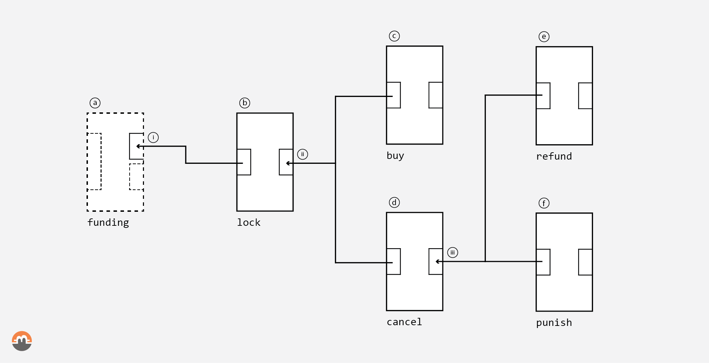
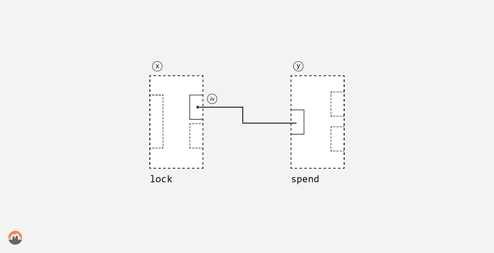

<pre>
  State: draft
  Created: 2020-12-11
</pre>

# 08. Transactions

## Overview

The protocol implemented in Farcaster is blockchain agnostic, however a strict list of features is required for the arbitrating blockchain involved in the swap, see *Blockchain Prerequisites* in [00. Introduction](./00-introduction.md#blockchain-prerequisites). This RFC describes a concrete implementation of the protocol with Bitcoin, or equivalent UTXO based blockchain, as the arbitrating blockchain and Monero, or equivalent UTXO based blockchain, as the accordant blockchain.

We distinguish transactions created and controlled by the protocol itself and external transactions. Dashed outline transactions are transactions created by external wallets, i.e. not the daemon nor the client. This allows no assumption on where the funds might arise from and retain full flexibility on the implementation side.

## Table of Contents

  * [Bitcoin](#bitcoin)
    * [Funding](#funding)
    * [Lock](#lock)
    * [Buy](#buy)
    * [Cancel](#cancel)
    * [Refund](#refund)
    * [Punish](#punish)
  * [Monero](#monero)
    * [Lock](#lock)
    * [Spend](#spend)
  * [Miscellaneous](#miscellaneous)
    * [Notes on Privacy](#notes-on-privacy)
    * [Transaction fee](#transaction-fee)
    * [Bitcoin transactions temporal safety](#bitcoin-transactions-temporal-safety)

## Bitcoin

This section defines the Bitcoin transactions. These transactions can be constructed with three different approaches:

 * **ECDSA Scripts**, with SegWit v0 outputs and ECDSA signatures
 * **Taproot Schnorr Scripts**, with SegWit v1 outputs and Schnorr signatures and on-chain multi-signature using TapLeaf scripts
 * **Taproot Schnorr MuSig2**, with SegWit v1 outputs and Schnorr signatures and MuSig2 off-chain multi-signature protocol

The latter is the preferred option for privacy but depends on feature activation on the Bitcoin chain and MuSig2 protocol. This RFC describes the three approaches for each of the protocol's transactions.

#### Timelocks

`[TIMEOUTOP]` is either `CHECKSEQUENCEVERIFY` or `CHECKLOCKTIMEVERIFY`.

#### Bitcoin transaction graph


*Fig 1. Arbitrating UTXO based transaction graph*

### Funding

The `funding (a)` transaction is an externally created transaction that serves two purposes:

 1. Force the creation of a SegWit UTXO for the `lock (b)` transaction
 2. Not make any assumption on where the funds come from

The transaction can have `n` inputs and `m` outputs but MUST create 1 and only 1 P2WPKH (SegWit v0) UTXO `(i)` for the given address during initialization.

The P2WPKH rationale is to have better support in the bitcoin wallet ecosystem, this can be moved to a (SegWit v1) P2TR later when support is added in wallets.

**Validation rules:**

This transaction has no particular validation rules by either of the swap roles.

### Lock

The `lock (b)` transaction consumes the SegWit UTXO `(i)` from `funding (a)` and creates the UTXO `(ii)`.

#### ECDSA Scripts

The `lock (b)` creates a (SegWit v0) UTXO `(ii)` with the locking script:

```
IF
    2 <the accordant seller's Ab PubKey> <the arbitrating seller's Bb(Ta) PubKey> 2 CHECKMULTISIG
ELSE
    <num> [TIMEOUTOP] DROP
    2 <the accordant seller's Ac PubKey> <the arbitrating seller's Bc PubKey> 2 CHECKMULTISIG
ENDIF

where
    Ab: the accordant seller's buy key;
    Bb: the arbitrating seller's buy key;
    Ac: the accordant seller's cancel key;
    Bc: the arbitrating seller's cancel key; and
    Ta: the accordant seller's adaptor key
```

**Validation rules:**

Upon receiving the transaction, the accordant seller must validate:

 * the buy script is composed of a 2-of-2 multisig with:
    * the first public key is `Ab`
    * the second public key is `Bb`
 * the cancel script is well-formed
    * the timelock `<num>` is set accordingly to the agreed parameter
    * the timelock operation `[TIMEOUTOP]` is set accordingly to the agreed parameter
    * the timelock operation `[TIMEOUTOP]` is followed by a `DROP` operation
    * the `DROP` is followed by a 2-of-2 multisig with:
        * the first public key is `Ac`
        * the second public key is `Bc`

#### Taproot Schnorr Scripts

The `lock (b)` creates a (SegWit v1) Taproot UTXO `(ii)` with the locking script `OP_1 0x20 <Q pubkey>`:

```
              Q                       | the Taproot tweaked key
              |
    ----------------------
    |                    |
    P           Script Merkle root    | P: an internal key where DLog is unknown
                         |
            /---------------------------\
    TapLeaf buy script        TapLeaf cancel script    | SegWit v1 scripts
```

with `TapLeaf buy script`:

```
<the accordant seller's Ab PubKey> CHECKSIG <the arbitrating seller's Bb(Ta) PubKey> CHECKSIGADD m
NUMEQUAL

where
    Ab: the accordant seller's buy key;
    Bb: the arbitrating seller's buy key; and
    Ta: the accordant seller's adaptor key
```

and `TapLeaf cancel script`, the cancel script, a 2-of-2 multisig with timelock constraint used by the `cancel (d)` transaction.

`TapLeaf cancel script`:

```
<num> [TIMEOUTOP]
EQUALVERIFY DROP
<the accordant seller's Ac PubKey> CHECKSIG <the arbitrating seller's Bc PubKey> CHECKSIGADD m
NUMEQUAL

where
    Ac: the accordant seller's cancel key; and
    Bc: the arbitrating seller's cancel key;
```

#### Taproot MuSig2

The `lock (b)` creates a (SegWit v1) Taproot UTXO `(ii)` with the locking script `OP_1 0x20 <Q pubkey>`:

```
              Q                        | the Taproot tweaked key
              |
    ----------------------
    |                    |
    P           Script Merkle root     | P: the internal key, a MuSig2 setup
                         |
              TapLeaf cancel script    | SegWit v1 script
```

`P`, the internal key, is a MuSig2 setup used by the `buy (c)` transaction for transmitting the adaptor signature:

```
P: Ab + Bb + Ta

where
    Ab: the accordant seller's buy key;
    Bb: the arbitrating seller's buy key; and
    Ta: the accordant seller's adaptor key
```

`TapLeaf cancel script`, the cancel script, as described in *Taproot Schnorr Scripts*.

### Buy

The `buy` transaction is available as soon as the local confirmation security threshold is reached by the accordant seller.

#### ECDSA Scripts

Consumes the `lock`'s output `(ii)` with:

```
0 <the arbitrating seller's Bb(Ta) signature> <the accordant seller's Ab signature> TRUE <script>
```

and leaks the adaptor `Ta` on `<the arbitrating seller's Bb(Ta) signature>` to the arbitrating seller.

**Validation rules:**

Upon receiving the arbitrating seller's `Bb(Ta)` signature, the accordant seller must validate:

 * the signature received is:
    * valid for `Bb`
    * a valid adaptor for `Bb(Ta)`

#### Taproot Schnorr Scripts

The script-path witness that consumes `lock`'s P2TR UTXO:

```
<nitems> <len> <input> <len> <script> <len> <c>
```

with `<input>`: an input that fulfills the spending conditions set by `<script>`, and `<c>` the control block;

where `<script>` is the `TapLeaf buy script`;

and `<input>`:

```
<the arbitrating seller's Bb(Ta) signature> <the accordant seller's Ab signature>
```

and leaks the adaptor `Ta` on `<the arbitrating seller's Bb(Ta) signature>` to the arbitrating seller.

#### Taproot MuSig2

Consumes the `lock`'s Taproot output `(ii)` with one valid signature for `<Q>` the Taproot tweaked key, generated with `<P>` (MuSig2+adaptor), revealing the second secret spend key to the counterparty (the arbitrating seller), effectively doing the swap.

### Cancel

The `cancel (d)` transaction consumes the `lock`'s output `(ii)` and creates the output `(iii)` used to cancel the swap by one of the participants.

#### ECDSA Scripts

Consumes the `lock`'s output `(ii)` with:

```
0 <the arbitrating seller's Bc signature> <the accordant seller's Ac signature> FALSE <script>
```

and creates a (SegWit v0) UTXO `(iii)` with the locking script:

```
IF
    2 <the accordant seller's Ar(Tb) PubKey> <the arbitrating seller's Br PubKey> 2 CHECKMULTISIG
ELSE
    <num> [TIMEOUTOP] DROP
    <the accordant seller's Ap PubKey> CHECKSIG
ENDIF

where
    Ar: the accordant seller's refund key;
    Br: the arbitrating seller's refund key;
    Ap: the accordant seller's punish key; and
    Tb: the arbitrating seller's adaptor key
```

**Validation rules:**

Upon receiving the transaction, the accordant seller must validate:

 * the refund script is composed of a 2-of-2 multisig with:
    * the first public key is `Ar`
    * the second public key is `Br`
 * the punish script is well-formed
    * the timelock `<num>` is set accordingly to the agreed parameter
    * the timelock operation `[TIMEOUTOP]` is set accordingly to the agreed parameter
    * the timelock operation `[TIMEOUTOP]` is followed by a `DROP` operation
    * the `DROP` is followed by `CHECKSIG` on `Ap` public key

Upon receiving the arbitrating seller's `Bc` signature, the accordant seller must validate:

 * the signature received is:
    * valid for `Bc`

Upon receiving the accordant seller's `Ac` signature, the arbitrating seller must validate:

 * the signature received is:
    * valid for `Ac`

#### Taproot Schnorr Scripts

The script-path witness that consumes `lock`'s P2TR UTXO:

```
<nitems> <len> <input> <len> <script> <len> <c>
```

with `<input>`: an input that fulfills the spending conditions set by `<script>`, and `<c>` the control block.

and `<input>`:

```
<the arbitrating seller's Bc signature> <the accordant seller's Ac signature>
```

Creates a Taproot UTXO `(iii)` with the locking script (SegWit v1) `OP_1 0x20 <Q' pubkey>`:


```
              Q'                      | the Taproot tweaked key
              |
    ----------------------
    |                    |
    P'          Script Merkle root    | P': an internal key where DLog is unknown
                         |
            /---------------------------\
  TapLeaf refund script        TapLeaf punish script    | SegWit v1 scripts
```

with `TapLeaf refund script`:

```
<the accordant seller's Ar(Tb) PubKey> CHECKSIG <the arbitrating seller's Br PubKey> CHECKSIGADD m
NUMEQUAL

where
    Ar: the accordant seller's refund key;
    Br: the arbitrating seller's refund key; and
    Tb: the arbitrating seller's adaptor key
```

and `TapLeaf punish script`, the punish script, a single signature (the accordant seller's) with timelock constraint used by the `punish (f)` transaction.

`TapLeaf punish script`:

```
<num> [TIMEOUTOP]
EQUALVERIFY DROP
<the accordant seller's Ap PubKey> CHECKSIGVERIFY

where
    Ap: the accordant seller's punish key;
```

#### Taproot MuSig2

The script-path witness that consumes `lock`'s P2TR UTXO is the same as described in *Taproot Schnorr Scripts*.

Creates a Taproot UTXO `(iii)` with the locking script (SegWit v1) `OP_1 0x20 <Q' pubkey>`:

```
              Q'                       | the Taproot tweaked key
              |
    ----------------------
    |                    |
    P'          Script Merkle root     | P': the internal key, a MuSig2 setup
                         |
              TapLeaf punish script    | SegWit v1 script
```

`P'`, the internal key, is a MuSig2 setup used by the `refund (e)` transaction for transmitting the second adaptor signature:

```
P': Ar + Br + Tb

where
    Ar: the accordant seller's refund key;
    Br: the arbitrating seller's refund key; and
    Tb: the arbitrating seller's adaptor key
```

`TapLeaf punish script`, the punish script, as described in *Taproot Schnorr Scripts*.

### Refund

The `refund (e)` transaction is available as soon as the local confirmation security threshold is reached by the arbitrating seller.

#### ECDSA Scripts

Consumes the `cancel (d)`'s output `(iii)` with:

```
0 <the arbitrating seller's Br signature> <the accordant seller's Ar(Tb) signature> FALSE <script>
```

and leaks the adaptor `Tb` on `<the accordant seller's Ar(Tb) signature>` to the accordant seller.

**Validation rules:**

Upon receiving the accordant seller's `Ar(Tb)` signature, the arbitrating seller must validate:

 * the signature received is:
    * valid for `Ar`
    * a valid adaptor for `Ar(Tb)`

#### Taproot Schnorr Scripts

The script-path witness that consumes `cancel`'s P2TR UTXO:

```
<nitems> <len> <input> <len> <script> <len> <c>
```

with `<input>`: an input that fulfills the spending conditions set by `<script>`, and `<c>` the control block;

where `<script>` is the `TapLeaf refund script`;

and `<input>`:

```
<the arbitrating seller's Br signature> <the accordant seller's Ar(Tb) signature>
```

and leaks the adaptor `Tb` on `<the accordant seller's Ar(Tb) signature>` to the accordant seller.

#### Taproot MuSig2

Consumes the `cancel`'s Taproot output `(iii)` with one valid signature for `<Q'>` the Taproot tweaked key, generated with `<P'>` (MuSig2+adaptor), revealing the second secret spend key to the counterparty (the accordant seller), effectively doing the refund.

### Punish

The `punish (f)` transaction consumes `cancel (d)`'s output `(iii)` and transfers the funds to the accordant seller and is available as soon as the timelock is passed.

**Validation rules:**

This transaction has no particular validation rules enforced by either of the swap roles.

#### ECDSA Scripts

Consumes the `cancel`'s output `(iii)` with:

```
<the accordant seller's Ap signature> FALSE <script>
```

#### Taproot Schnorr Scripts & Taproot MuSig2

The script-path witness that consumes `cancel`'s P2TR UTXO:

```
<nitems> <len> <input> <len> <script> <len> <c>
```

with `<input>`: an input that fulfills the spending conditions set by `<script>`, and `<c>` the control block;

where `<script>` is the `TapLeaf punish script`;

and `<input>`:

```
<the accordant seller's Ap signature>
```

## Monero

Two external Monero transactions are defined: the `lock (x)` transaction and the `spend (y)` transaction. The spend transaction consumes the protocol created output from the `lock (x)` transaction by complying with the condition `(iv)`.


*Fig 2. Accordant UTXO based transaction graph*

> It is worth noting that all Monero transactions can be handled by an external wallet, or more precisely by importing the private keys into external software.

### Lock

The Monero `lock (x)` transaction is performed by an external wallet and MUST send the full negotiated amount to the address attached to `(iv)`. The transaction MUST NOT be broadcasted too early in the protocol, otherwise, funds will be lost.

The condition `(iv)` is defined during the protocol initialization phase as a shared secret between the two participants as:

    k_s = k_s^a + k_s^b (mod l)    | the private spend key of the address
    k_v = k_v^a + k_v^b (mod l)    | the private view key of the address

`k_v` is shared and known by both participants.

### Spend

The Monero `spend (y)` transaction allows the final owner of the funds to move them into an address without revealing the private view key to anyone else for better anonymity. This step is not necessary from a security point of view but is required for good privacy.

The spend transaction has to follow the minimum Monero output age policy (10 blocks).

## Miscellaneous

### Notes on Privacy

Bitcoin transaction must be designed in a way where if Taproot and MuSig2 are used with a single signature to spend an output, it MUST not be possible to differentiate between `c` and `d`, and between `e` and `f`.

But in most cases, `c` and `d` will be different because `d` will be used with the TapLeaf script.

Also, when a script-path spend is chosen, the script and the control block should look indistinguishable from a common protocol - such as Lightning Network - to increase the anonymity pool.

### Transaction fee

On the arbitrating blockchain, a chain of three transactions is created, the two last transactions must be created in advance, and their fees must be determined at creation.

We describe in this chapter a heuristic for setting the fees.

Let's define `f(tx, c)`, a function returning the fee over time for a transaction `tx` based on a coefficient `c`.

If `c(buy) = 1`, then `c(cancel) > 1`, such that at time `t` when `buy` and `cancel` are both available `cancel` has a higher probability to be mined.

It is worth noting that we cannot control the coefficients `c` between `refund` and `punish` as `punish` is controlled unilaterally by the accordant seller.

#### Replace By Fee (RBF)

Replace By Fee (RBF) should be integrated into the protocol such that multiple versions of some transactions can exist and transactions can be cooperatively bumped to get into the blockchain within the temporal safety window.

### Bitcoin transactions temporal safety

In the swap protocol publishing transactions to the bitcoin mempool (=transaction pool) reveals secret keys that are required to sweep the monero wallet. Therefore it is paramount to carefully evaluate the temporal safety bounds of publishing transactions, as they may:

 - be raced by valid and pre-signed protocol's transactions that are de facto double-spends or
 - reverted by blockchain reorgs

#### Protocol

Here we offer a simple protocol that may be used for publishing each transaction to the Bitcoin blockchain without putting funds at risk.

The swap participant has a temporal safety parameter, `delta_irreversible`, in blocks. If a transaction is mined at block `t`, at `t + delta_irreversible`, the participant assumes that her transaction is irreversible.

##### Funding

After the atomic swap protocol initialization successfully completes, the arbitrating seller can publish the funding transaction. the arbitrating seller publishes the funding transaction, which is later mined at block height `t(funding)`.

At `t(funding) + delta_irreversible` the accordant seller assumes the arbitrating seller's transaction is irreversible and may move on with the protocol execution. That is, the accordant seller can publish her buy transaction.

##### Buy

However the accordant seller should not wait too long for publishing the buy transaction as the cancellation path may become available, and then a race condition (double spend) between the swap (buy transaction) and the cancellation (cancel transaction) paths becomes possible.

The safety parameter to prevent race conditions (=double spends) is `delta_race`, in blocks.

The cancellation path becomes valid at time `t(funding) + delta(cancel)$`. Thus the accordant seller has to publish her buy transaction the latest at

    t(funding) + delta(cancel) - delta_race


In sum, the accordant seller's safety window to publish the buy transaction is from

    t(funding) + delta_irreversible

to

    t(funding) + delta(cancel) - delta_race

where

    delta_irreversible < delta_race < delta(cancel)

A reasonable (i.e. safely conservative) guesstimate:

    delta_race ~= 10 x delta_irreversible


Note that `delta_irreversible` and `delta_race` must be proportional to the amount transacted. Additionally `delta_race` is proportional to mempool congestion.

The same logic applies to the cancellation path.

##### Cancel

Cancel transaction should be published as soon as it becomes valid, that is, after

    t(funding) + delta(cancel)

The block height at which cancel transaction is mined is `t(cancel)`

##### Refund

Refund transaction safety window for publication

    t(cancel) + delta_irreversible

to

    t(cancel) + delta(punish) - delta_race

It can be argued that the higher bound of the refund transaction window can be extended, not deliberately and safely, but in emergency cases where the arbitrating seller could not be online. The refund transaction must be published before the punish transaction gets mined, as they consume the same output from the cancel transaction.

The counterargument is that if the arbitrating seller publishes the refund transaction, the accordant seller can retrieve the secret key and will get the monero, and might as well get the bitcoin if she wins the race.

While if she only gets the bitcoin, and the monero stays locked, the arbitrating seller could set up a new swap to unlock the already locked monero (no cost for the accordant seller) and propose a nice reward to the accordant seller for revealing her private key. That is a fairly graceful failure.

##### Punish

Punish transaction should be published as soon as it becomes valid, that is, after `t(cancel) + delta(punish)`

